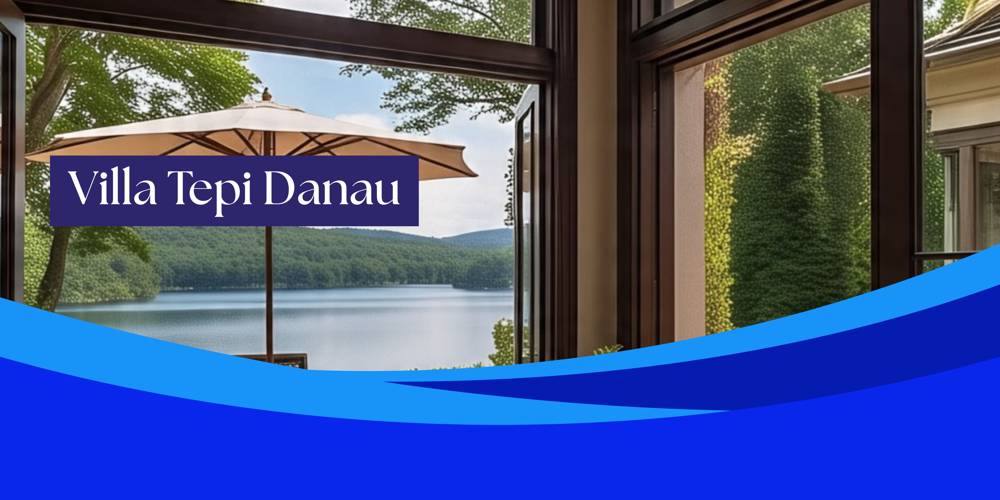

Laporan Proyek: Sistem Boking Villa
1. Pendahuluan
Proyek ini adalah sebuah aplikasi web sederhana untuk memfasilitasi pemesanan vila secara online. Pengguna dapat melihat daftar vila yang tersedia, melihat detail masing-masing vila, dan melakukan pemesanan. Aplikasi ini dikembangkan menggunakan teknologi dasar web seperti HTML untuk struktur, CSS untuk gaya, dan JavaScript untuk fungsionalitas interaktif.
2. Fitur-fitur Utama
Tampilan Daftar Vila: Menampilkan daftar vila yang tersedia dengan informasi singkat seperti nama, lokasi, dan harga per malam.
Detail Vila: Pengguna dapat mengklik setiap vila untuk melihat informasi lebih detail, termasuk deskripsi lengkap, fasilitas, dan galeri gambar (jika diimplementasikan lebih lanjut).
Formulir Pemesanan: Menyediakan formulir bagi pengguna untuk memasukkan tanggal check-in, tanggal check-out, jumlah tamu, dan informasi kontak.

3. Teknologi yang Digunakan
HTML: Digunakan untuk struktur dasar halaman web, termasuk elemen-elemen untuk menampilkan daftar vila, detail, dan formulir.
CSS: Digunakan untuk styling dan tata letak aplikasi, membuat tampilan yang menarik dan responsif. Ini mencakup styling untuk kartu vila, formulir, navigasi, dan elemen UI lainnya.
JavaScript: Digunakan untuk menambahkan interaktivitas dan fungsionalitas dinamis.
4. Struktur File Proyek
	Berikut adalah struktur direktori yang direkomendasikan untuk proyek ini:
			
/nama_project
│── index.html             # Halaman utama website (wajib ada)
│── README.md              # Dokumentasi project di GitHub
│── /css                   # Folder untuk file CSS
│   ├── styles.css         # File utama untuk styling (jika menggunakan CSS murni)
│   ├── bootstrap.min.css  # (Opsional) Bootstrap jika digunakan
│── /js                    # Folder untuk file JavaScript
│   ├── script.js          # File utama untuk interaktivitas
│   ├── jquery.min.js      # jQuery (jika digunakan)
│── /media                 # Folder untuk gambar dan aset media
│   ├── logo.png           # Contoh logo
│   ├── banner.jpg         # Contoh banner

Penjelasan Struktur Folder & File:

-File index.html (Halaman Utama)
Halaman utama website yang berfungsi sebagai entry point utama.
Harus berisi tautan navigasi ke halaman lain.

-File README.md (Laporan dan Dokumentasi Project)
Wajib ada di GitHub untuk laporan dan dokumentasi project.
Sistematika laporan dijelaskan di bawah.

-Folder /css (Penyimpanan File CSS)
Berisi file CSS utama (styles.css) yang mengatur tampilan website jika menggunakan CSS murni.
Jika menggunakan Bootstrap, file Bootstrap bisa disertakan di folder ini.

-Folder /js (Penyimpanan File JavaScript)
Berisi file JS utama (script.js) yang menangani interaktivitas website.
File jquery.min.js dapat disertakan jika menggunakan jQuery.

-Folder /media (Penyimpanan Gambar & Aset Media)
Berisi gambar yang digunakan dalam project, seperti logo, ikon, banner dan gambar lainnya.
Aset media lainnya seperti audio dan video juga ditempatkan di folder ini.
File harus diberi nama yang deskriptif untuk memudahkan identifikasi.

5. Cuplikan code

       1.index.html
<!DOCTYPE html>
<html lang="id">
<head>
  <meta charset="UTF-8">
  <meta name="viewport" content="width=device-width, initial-scale=1.0">
  <title> Home - Booking Villa</title>
  <link rel="stylesheet" href="css/index.css">
</head>
<body>
  <header>
    
    <h1>Selamat Datang di Villa</h1>
    <nav>
      <ul class="nav">
        <li><a href="daftar-villa.html">Daftar Villa</a></li>
        <li><a href="galeri.html">Galeri</a></li>
        <li><a href="promo.html">Promo</a></li>
        <li><a href="kontak.html">Kontak</a></li>
      </ul>
    </nav>
  </header>

	2.css/style.css: 
body {
  margin: 0;
  font-family: 'Segoe UI', Tahoma, Geneva, Verdana, sans-serif;
  background-color: #f5f5f5;
  color: #333;
}

header {
  text-align: center;
  background-color: #333;
  color: #fff;
  padding-bottom: 1rem;
}

	3.js/script.js:   
const villas = [
  {
    nama: 'Villa modern dengan Kolam Renang',
    harga: 3500000,
    fasilitas: ['kolam'],
    img: 'media/villamodern.jpg',
    deskripsi: 'Villa mewah dengan kolam renang pribadi.'
  },
  {
    nama: 'Villa keluarga',
    harga: 5000000,
    fasilitas: ['danau', 'kolam'],
    img: 'media/villakeluarga.jpg',
    deskripsi: 'Villa luas berkapasitas lebih dari 10 orang dengan pemandangan danau, kolam pribadi, cocok untuk keluarga besar.'
  },
  {
    nama: 'Villa Hemat ',
    harga: 1800000,
    fasilitas: ['kolam'],
    img: 'media/villahemat.jpg',
    deskripsi: 'Villa harga terjangkau dengan kolam renang.'
  },
  {
    nama: 'Villa Sunset View',
    harga: 2000000,
    fasilitas: ['danau'],
    img: 'media/villasunset.jpg',
    deskripsi: 'Menikmati sunset langsung dari balkon villa dengan pemandangan danau.'
  }
];

6.Kesimpulan
Proyek ini berhasil membuat sebuah halaman pemesanan villa secara online yang sederhana dan interaktif.
